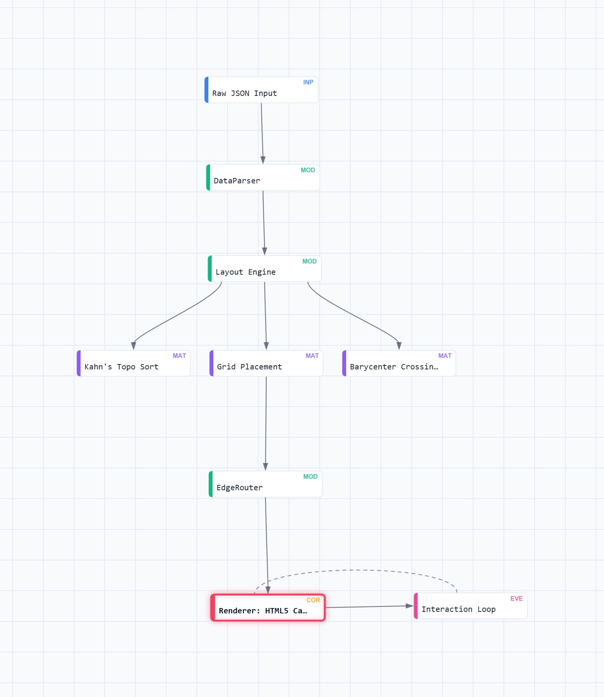

# ab.js
   

> **High-performance data lineage engine · Zero-dependency math · Built for complex DAG visualization**

## What is ab.js?

[**ab.js**](https://bh00t.github.io/ab.js/) is a production-grade, lightweight visualization engine designed specifically for **Data Lineage** and **Complex DAGs** (Directed Acyclic Graphs). Unlike standard libraries that rely on heavy, unpredictable physics simulations (force-directed graphs), ab.js uses purely deterministic geometric math and barycenter heuristics to render hundreds of nodes with sub-millisecond layout times and zero overlapping lines.

The project was built to solve a specific problem: **Visualizing SQL transformations and enterprise data pipelines without the "spiderweb" mess.**

> [!IMPORTANT]
> **Origins:** ab.js was originally developed as a core feature of [**Redshift Lens**](https://github.com/bh00t/Redshift-Lens). Due to its high performance and reliability, the engine was decoupled into a standalone library, allowing it to be used in any data lineage or DAG-based web application.

## Core Features

The engine provides a premium, "IDE-like" experience tailored for data engineers and architects:

* **Four Deterministic Layouts:** Instantly toggle between **Left-to-Right**, **Top-to-Bottom**, **Waterfall** (strict hierarchical cascading), and **Compact Matrix** (fishbone packing for massive graphs).
* **Compound Graphs (Node Grouping):** Automatically calculates boundaries and draws dynamic, aesthetic bounding boxes around nodes sharing a `group` tag.
* **Graph Transformation & Edge Bypassing:** Dynamically filter the graph to show only Upstream/Downstream lineage, or completely "bypass" specific node types (e.g., hiding `PROCEDURE` nodes while seamlessly stitching the surrounding `TABLE` nodes together).
* **Smart Edge Routing:** Cubic Bezier curves with algorithmic "port spreading" to prevent the "bus problem" (overlapping lines at node faces). Detects and formats cyclic loopbacks with dashed lines.
* **Level of Detail (LOD) Optimization:** Maintains 60fps on massive graphs by dynamically culling off-screen elements, disabling expensive typography/shadows at high zoom levels, and falling back to straight lines for 100+ edge clusters.
* **Interactive Tooling:** Marquee box-selection, node dragging, click-to-pin, BFS-powered upstream/downstream highlight tracing, and high-resolution off-screen PNG exporting.

## Architecture
The engine logic is strictly modular, separating data processing, mutation, coordinate math, and canvas painting.



### Modular Components

| Module | Responsibility |
| :--- | :--- |
| **DataParser** | Standardizes raw incoming JSON into the internal graph dictionary. |
| **LayoutEngine** | *The Math.* Calculates X/Y coordinates using Kahn's topological sorting, DFS cycle detection, and crossing reduction heuristics. |
| **EdgeRouter** | Calculates face tangents and geometric port offsets for connecting lines. |
| **Renderer** | Handles high-DPI canvas painting, LOD culling, typography, and theme-aware styling (Dark/Light mode). |

## Integration & API

ab.js consumes a simple, flat JSON structure. The engine automatically infers relationships and builds the hierarchy.

### 1. The Data Format
```json
{
  "main": "dw_fact_sales",
  "nodes": [
    { "id": "stg_users", "name": "users", "schema": "stg", "type": "VIEW", "group": "Staging" },
    { "id": "dw_fact_sales", "name": "fact_sales", "schema": "dw", "type": "TABLE", "group": "Core" }
  ],
  "edges": [
    ["stg_users", "dw_fact_sales"]
  ]
}
```

### 2. Initialization
```javascript
// Initialize the engine and attach it to a canvas ID
const graph = new LineageApp(yourJsonData, 'canvas-id', { background: 'dot' });
```

## Repo Structure

```text
ab-js/
├── index.html       # UI Shell, Toolbars & Event Handlers
├── ab.js            # Core Engine Logic, Transformer, and Math
└── README.md        # Project Documentation
```

## Getting Started

1. **Clone the repository:**
   `git clone https://github.com/your-username/ab-js.git`
2. Ensure `index.html` and `ab.js` are in the same folder.
3. Open `index.html` in any modern web browser.
4. Paste your graph data into the **Load JSON** modal to render your lineage.

---
_ab.js · Born from Redshift Lens · Built for Data Engineers · Pure Math · High Performance_